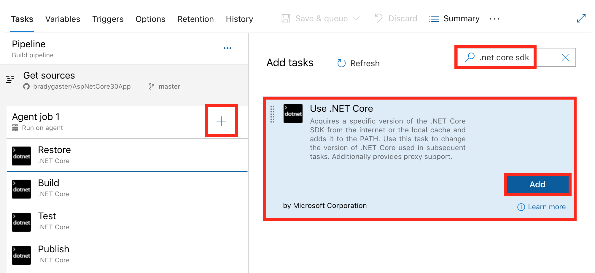
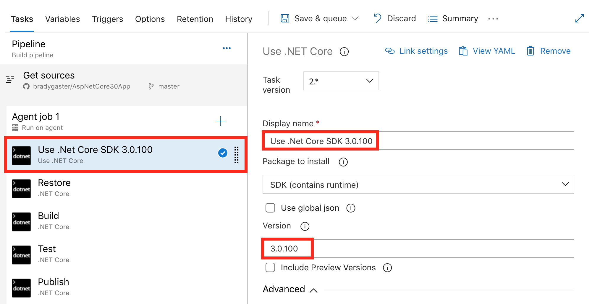
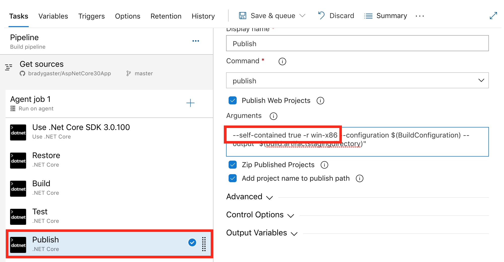

# Deploy ASP.NET Core apps to Azure App Service

[Azure App Service](https://azure.microsoft.com/services/app-service/) is a [Microsoft cloud computing platform service](https://azure.microsoft.com/) for hosting web apps, including ASP.NET Core.

## Useful resources

[App Service Documentation](/azure/app-service/) is the home for Azure Apps documentation, tutorials, samples, how-to guides, and other resources. Two notable tutorials that pertain to hosting ASP.NET Core apps are:

[Create an ASP.NET Core web app in Azure](/azure/app-service/app-service-web-get-started-dotnet)  
Use Visual Studio to create and deploy an ASP.NET Core web app to Azure App Service on Windows.

[Create an ASP.NET Core app in App Service on Linux](/azure/app-service/containers/quickstart-dotnetcore)  
Use the command line to create and deploy an ASP.NET Core web app to Azure App Service on Linux.

See the [ASP.NET Core on App Service Dashboard](https://aspnetcoreon.azurewebsites.net/) for the version of ASP.NET Core available on Azure App service.

Subscribe to the [App Service Announcements](https://github.com/Azure/app-service-announcements/) repository and watch the issues. The App Service team regularly posts updates in the issues section of the repository to announce updates and features arriving in App Service. 

The following articles are available in ASP.NET Core documentation:

<xref:tutorials/publish-to-azure-webapp-using-vs>  
Learn how to publish an ASP.NET Core app to Azure App Service using Visual Studio.

<xref:host-and-deploy/azure-apps/azure-continuous-deployment>  
Learn how to create an ASP.NET Core web app using Visual Studio and deploy it to Azure App Service using Git for continuous deployment.

[Create your first pipeline](/azure/devops/pipelines/get-started-yaml)  
Set up a CI build for an ASP.NET Core app, then create a continuous deployment release to Azure App Service.

[Azure Web App sandbox](https://github.com/projectkudu/kudu/wiki/Azure-Web-App-sandbox)  
Discover Azure App Service runtime execution limitations enforced by the Azure Apps platform.

<xref:test/troubleshoot>  
Understand and troubleshoot warnings and errors with ASP.NET Core projects.

## Application configuration

### Platform

::: moniker range=">= aspnetcore-2.2"

Runtimes for 64-bit (x64) and 32-bit (x86) apps are present on Azure App Service. The [.NET Core SDK](/dotnet/core/sdk) available on App Service is 32-bit, but you can deploy 64-bit apps built locally using the [Kudu](https://github.com/projectkudu/kudu/wiki) console or the publish process in Visual Studio. For more information, see the [Publish and deploy the app](#publish-and-deploy-the-app) section.

::: moniker-end

::: moniker range="< aspnetcore-2.2"

For apps with native dependencies, runtimes for 32-bit (x86) apps are present on Azure App Service. The [.NET Core SDK](/dotnet/core/sdk) available on App Service is 32-bit.

::: moniker-end

For more information on .NET Core framework components and distribution methods, such as information on the .NET Core runtime and the .NET Core SDK, see [About .NET Core: Composition](/dotnet/core/about#composition).

### Packages

Include the following NuGet packages to provide automatic logging features for apps deployed to Azure App Service:

* [Microsoft.AspNetCore.AzureAppServices.HostingStartup](https://www.nuget.org/packages/Microsoft.AspNetCore.AzureAppServices.HostingStartup/) uses [IHostingStartup](xref:fundamentals/configuration/platform-specific-configuration) to provide ASP.NET Core light-up integration with Azure App Service. The added logging features are provided by the `Microsoft.AspNetCore.AzureAppServicesIntegration` package.
* [Microsoft.AspNetCore.AzureAppServicesIntegration](https://www.nuget.org/packages/Microsoft.AspNetCore.AzureAppServicesIntegration/) executes [AddAzureWebAppDiagnostics](/dotnet/api/microsoft.extensions.logging.azureappservicesloggerfactoryextensions.addazurewebappdiagnostics) to add Azure App Service diagnostics logging providers in the `Microsoft.Extensions.Logging.AzureAppServices` package.
* [Microsoft.Extensions.Logging.AzureAppServices](https://www.nuget.org/packages/Microsoft.Extensions.Logging.AzureAppServices/) provides logger implementations to support Azure App Service diagnostics logs and log streaming features.

The preceding packages aren't available from the [Microsoft.AspNetCore.App metapackage](xref:fundamentals/metapackage-app). Apps that target .NET Framework or reference the `Microsoft.AspNetCore.App` metapackage must explicitly reference the individual packages in the app's project file.

## Override app configuration using the Azure Portal

App settings in the Azure Portal permit you to set environment variables for the app. Environment variables can be consumed by the [Environment Variables Configuration Provider](xref:fundamentals/configuration/index#environment-variables-configuration-provider).

When an app setting is created or modified in the Azure Portal and the **Save** button is selected, the Azure App is restarted. The environment variable is available to the app after the service restarts.

::: moniker range=">= aspnetcore-3.0"

When an app uses the [Generic Host](xref:fundamentals/host/generic-host), environment variables aren't loaded into an app's configuration by default and the configuration provider must be added by the developer. The developer determines the environment variable prefix when the configuration provider is added. For more information, see <xref:fundamentals/host/generic-host> and the [Environment Variables Configuration Provider](xref:fundamentals/configuration/index#environment-variables-configuration-provider).

::: moniker-end

::: moniker range="< aspnetcore-3.0"

When an app builds the host using [WebHost.CreateDefaultBuilder](/dotnet/api/microsoft.aspnetcore.webhost.createdefaultbuilder), environment variables that configure the host use the `ASPNETCORE_` prefix. For more information, see <xref:fundamentals/host/web-host> and the [Environment Variables Configuration Provider](xref:fundamentals/configuration/index#environment-variables-configuration-provider).

::: moniker-end

## Proxy server and load balancer scenarios

The [IIS Integration Middleware](xref:host-and-deploy/iis/index#enable-the-iisintegration-components), which configures Forwarded Headers Middleware when hosting [out-of-process](xref:host-and-deploy/iis/index#out-of-process-hosting-model), and the ASP.NET Core Module are configured to forward the scheme (HTTP/HTTPS) and the remote IP address where the request originated. Additional configuration might be required for apps hosted behind additional proxy servers and load balancers. For more information, see [Configure ASP.NET Core to work with proxy servers and load balancers](xref:host-and-deploy/proxy-load-balancer).

## Monitoring and logging

::: moniker range=">= aspnetcore-3.0"

ASP.NET Core apps deployed to App Service automatically receive an App Service extension, **ASP.NET Core Logging Integration**. The extension enables logging integration for ASP.NET Core apps on Azure App Service.

::: moniker-end

::: moniker range="< aspnetcore-3.0"

ASP.NET Core apps deployed to App Service automatically receive an App Service extension, **ASP.NET Core Logging Extensions**. The extension enables logging integration for ASP.NET Core apps on Azure App Service.

::: moniker-end

For monitoring, logging, and troubleshooting information, see the following articles:

[Monitor apps in Azure App Service](/azure/app-service/web-sites-monitor)  
Learn how to review quotas and metrics for apps and App Service plans.

[Enable diagnostics logging for apps in Azure App Service](/azure/app-service/web-sites-enable-diagnostic-log)  
Discover how to enable and access diagnostic logging for HTTP status codes, failed requests, and web server activity.

<xref:fundamentals/error-handling>  
Understand common approaches to handling errors in ASP.NET Core apps.

<xref:test/troubleshoot-azure-iis>  
Learn how to diagnose issues with Azure App Service deployments with ASP.NET Core apps.

<xref:host-and-deploy/azure-iis-errors-reference>  
See the common deployment configuration errors for apps hosted by Azure App Service/IIS with troubleshooting advice.

## Data Protection key ring and deployment slots

[Data Protection keys](xref:security/data-protection/implementation/key-management#data-protection-implementation-key-management) are persisted to the *%HOME%\ASP.NET\DataProtection-Keys* folder. This folder is backed by network storage and is synchronized across all machines hosting the app. Keys aren't protected at rest. This folder supplies the key ring to all instances of an app in a single deployment slot. Separate deployment slots, such as Staging and Production, don't share a key ring.

When swapping between deployment slots, any system using data protection won't be able to decrypt stored data using the key ring inside the previous slot. ASP.NET Cookie Middleware uses data protection to protect its cookies. This leads to users being signed out of an app that uses the standard ASP.NET Cookie Middleware. For a slot-independent key ring solution, use an external key ring provider, such as:

* Azure Blob Storage
* Azure Key Vault
* SQL store
* Redis cache

For more information, see <xref:security/data-protection/implementation/key-storage-providers>.
<a name="deploy-aspnet-core-preview-release-to-azure-app-service"></a>

## Deploy ASP.NET Core 3.0 to Azure App Service

ASP.NET Core 3.0 is supported on Azure App Service. To deploy a preview release of a .NET Core version later than .NET Core 3.0, use one of the following techniques. These approaches are also used when the runtime is available but the SDK hasn't been installed on Azure App Service.

* [Specify the .NET Core SDK Version using Azure Pipelines](#specify-the-net-core-sdk-version-using-azure-pipelines)
* [Deploy a self-contained preview app](#deploy-a-self-contained-preview-app).
* [Use Docker with Web Apps for containers](#use-docker-with-web-apps-for-containers).
* [Install the preview site extension](#install-the-preview-site-extension).

### Specify the .NET Core SDK Version using Azure Pipelines

Use [Azure App Service CI/CD scenarios](/azure/app-service/deploy-continuous-deployment) to set up a continuous integration build with Azure DevOps. After the Azure DevOps build is created, optionally configure the build to use a specific SDK version. 

#### Specify the .NET Core SDK version

If you use the App Service deployment center to create your Azure DevOps build, the resulting build pipeline will have steps for `Restore`, `Build`, `Test`, and `Publish`. To specify the SDK version, click the "Add (+)" button in the Agent job list to add a new step. Search for **.NET Core SDK** in the search bar. 



Move the step into the first position in the build, so that the steps following it are sure to use that version of the .NET Core SDK. Specify the version of the .NET Core SDK you wish to use. In this example, the SDK has been set to the `3.0.100`. 



If you want to publish a self-contained app, you can specify in the `Publish` step to self-contain the app and the [RID](https://docs.microsoft.com/en-us/dotnet/core/rid-catalog) you want to use. 



### Deploy a self-contained preview app

A [self-contained deployment (SCD)](/dotnet/core/deploying/#self-contained-deployments-scd) that targets a preview runtime carries the preview runtime in the deployment.

When deploying a self-contained app:

* The site in Azure App Service doesn't require the [preview site extension](#install-the-preview-site-extension).
* The app must be published following a different approach than when publishing for a [framework-dependent deployment (FDD)](/dotnet/core/deploying#framework-dependent-deployments-fdd).

Follow the guidance in the [Deploy the app self-contained](#deploy-the-app-self-contained) section.

### Use Docker with Web Apps for containers

The [Docker Hub](https://hub.docker.com/r/microsoft/aspnetcore/) contains the latest preview Docker images. The images can be used as a base image. Use the image and deploy to Web Apps for Containers normally.

### Install the preview site extension

If a problem occurs using the preview site extension, open an [aspnet/AspNetCore issue](https://github.com/aspnet/AspNetCore/issues).

1. From the Azure Portal, navigate to the App Service.
1. Select the web app.
1. Type "ex" in the search box to filter for "Extensions" or scroll down the list of management tools.
1. Select **Extensions**.
1. Select **Add**.
1. Select the **ASP.NET Core {X.Y} ({x64|x86}) Runtime** extension from the list, where `{X.Y}` is the ASP.NET Core preview version and `{x64|x86}` specifies the platform.
1. Select **OK** to accept the legal terms.
1. Select **OK** to install the extension.

When the operation completes, the latest .NET Core preview is installed. Verify the installation:

1. Select **Advanced Tools**.
1. Select **Go** in **Advanced Tools**.
1. Select the **Debug console** > **PowerShell** menu item.
1. At the PowerShell prompt, execute the following command. Substitute the ASP.NET Core runtime version for `{X.Y}` and the platform for `{PLATFORM}` in the command:

   ```powershell
   Test-Path D:\home\SiteExtensions\AspNetCoreRuntime.{X.Y}.{PLATFORM}\
   ```

   The command returns `True` when the x64 preview runtime is installed.

> [!NOTE]
> The platform architecture (x86/x64) of an App Services app is set in the app's settings in the Azure Portal for apps that are hosted on an A-series compute or better hosting tier. If the app is run in in-process mode and the platform architecture is configured for 64-bit (x64), the ASP.NET Core Module uses the 64-bit preview runtime, if present. Install the **ASP.NET Core {X.Y} (x64) Runtime** extension.
>
> After installing the x64 preview runtime, run the following command in the Kudu PowerShell command window to verify the installation. Substitute the ASP.NET Core runtime version for `{X.Y}` in the command:
>
> ```powershell
> Test-Path D:\home\SiteExtensions\AspNetCoreRuntime.{X.Y}.x64\
> ```
>
> The command returns `True` when the x64 preview runtime is installed.

> [!NOTE]
> **ASP.NET Core Extensions** enables additional functionality for ASP.NET Core on Azure App Services, such as enabling Azure logging. The extension is installed automatically when deploying from Visual Studio. If the extension isn't installed, install it for the app.

**Use the preview site extension with an ARM template**

If an ARM template is used to create and deploy apps, the `siteextensions` resource type can be used to add the site extension to a web app. For example:

[!code-json[](index/sample/arm.json?highlight=2)]

## Publish and deploy the app

### Deploy the app framework-dependent

::: moniker range=">= aspnetcore-2.2"

For a 64-bit [framework-dependent deployment](/dotnet/core/deploying/#framework-dependent-deployments-fdd):

* Use a 64-bit .NET Core SDK to build a 64-bit app.
* Set the **Platform** to **64 Bit** in the App Service's **Configuration** > **General settings**. The app must use a Basic or higher service plan to enable the choice of platform bitness.

::: moniker-end

# [Visual Studio](#tab/visual-studio)

1. Select **Build** > **Publish {Application Name}** from the Visual Studio toolbar or right-click the project in **Solution Explorer** and select **Publish**.
1. In the **Pick a publish target** dialog, confirm that **App Service** is selected.
1. Select **Advanced**. The **Publish** dialog opens.
1. In the **Publish** dialog:
   * Confirm that the **Release** configuration is selected.
   * Open the **Deployment Mode** drop-down list and select **Framework-Dependent**.
   * Select **Portable** as the **Target Runtime**.
   * If you need to remove additional files upon deployment, open **File Publish Options** and select the check box to remove additional files at the destination.
   * Select **Save**.
1. Create a new site or update an existing site by following the remaining prompts of the publish wizard.

# [.NET Core CLI](#tab/netcore-cli/)

1. In the project file, don't specify a [Runtime Identifier (RID)](/dotnet/core/rid-catalog).

1. From a command shell, publish the app in Release configuration with the [dotnet publish](/dotnet/core/tools/dotnet-publish) command. In the following example, the app is published as a framework-dependent app:

   ```console
   dotnet publish --configuration Release
   ```

1. Move the contents of the *bin/Release/{TARGET FRAMEWORK}/publish* directory to the site in App Service. If dragging the *publish* folder contents from your local hard drive or network share directly to App Service in the [Kudu](https://github.com/projectkudu/kudu/wiki) console, drag the files to the `D:\home\site\wwwroot` folder in the Kudu console.

---

### Deploy the app self-contained

Use Visual Studio or the command-line interface (CLI) tools for a [self-contained deployment (SCD)](/dotnet/core/deploying/#self-contained-deployments-scd).

# [Visual Studio](#tab/visual-studio)

1. Select **Build** > **Publish {Application Name}** from the Visual Studio toolbar or right-click the project in **Solution Explorer** and select **Publish**.
1. In the **Pick a publish target** dialog, confirm that **App Service** is selected.
1. Select **Advanced**. The **Publish** dialog opens.
1. In the **Publish** dialog:
   * Confirm that the **Release** configuration is selected.
   * Open the **Deployment Mode** drop-down list and select **Self-Contained**.
   * Select the target runtime from the **Target Runtime** drop-down list. The default is `win-x86`.
   * If you need to remove additional files upon deployment, open **File Publish Options** and select the check box to remove additional files at the destination.
   * Select **Save**.
1. Create a new site or update an existing site by following the remaining prompts of the publish wizard.

# [.NET Core CLI](#tab/netcore-cli/)

1. In the project file, specify one or more [Runtime Identifiers (RIDs)](/dotnet/core/rid-catalog). Use `<RuntimeIdentifier>` (singular) for a single RID, or use `<RuntimeIdentifiers>` (plural) to provide a semicolon-delimited list of RIDs. In the following example, the `win-x86` RID is specified:

   ```xml
   <PropertyGroup>
     <TargetFramework>{TARGET FRAMEWORK}</TargetFramework>
     <RuntimeIdentifier>win-x86</RuntimeIdentifier>
   </PropertyGroup>
   ```

1. From a command shell, publish the app in Release configuration for the host's runtime with the [dotnet publish](/dotnet/core/tools/dotnet-publish) command. In the following example, the app is published for the `win-x86` RID. The RID supplied to the `--runtime` option must be provided in the `<RuntimeIdentifier>` (or `<RuntimeIdentifiers>`) property in the project file.

   ```console
   dotnet publish --configuration Release --runtime win-x86 --self-contained
   ```

1. Move the contents of the *bin/Release/{TARGET FRAMEWORK}/{RUNTIME IDENTIFIER}/publish* directory to the site in App Service. If dragging the *publish* folder contents from your local hard drive or network share directly to App Service in the Kudu console, drag the files to the `D:\home\site\wwwroot` folder in the Kudu console.

---

## Protocol settings (HTTPS)

Secure protocol bindings allow you specify a certificate to use when responding to requests over HTTPS. Binding requires a valid private certificate (*.pfx*) issued for the specific hostname. For more information, see [Tutorial: Bind an existing custom SSL certificate to Azure App Service](/azure/app-service/app-service-web-tutorial-custom-ssl).

## Transform web.config

If you need to transform *web.config* on publish (for example, set environment variables based on the configuration, profile, or environment), see <xref:host-and-deploy/iis/transform-webconfig>.

## Additional resources

* [App Service overview](/azure/app-service/app-service-web-overview)
* [Azure App Service: The Best Place to Host your .NET Apps (55-minute overview video)](https://channel9.msdn.com/events/dotnetConf/2017/T222)
* [Azure Friday: Azure App Service Diagnostic and Troubleshooting Experience (12-minute video)](https://channel9.msdn.com/Shows/Azure-Friday/Azure-App-Service-Diagnostic-and-Troubleshooting-Experience)
* [Azure App Service diagnostics overview](/azure/app-service/app-service-diagnostics)
* <xref:host-and-deploy/web-farm>

Azure App Service on Windows Server uses [Internet Information Services (IIS)](https://www.iis.net/). The following topics pertain to the underlying IIS technology:

* <xref:host-and-deploy/iis/index>
* <xref:host-and-deploy/aspnet-core-module>
* <xref:host-and-deploy/iis/modules>
* [Windows Server - IT administrator content for current and previous releases](/windows-server/windows-server-versions)
